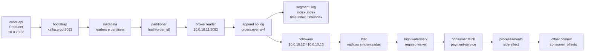

# Jornada de uma mensagem pelo Kafka

Este documento detalha, etapa por etapa, o que acontece quando uma mensagem passa pelo Kafka. A leitura deve vir antes dos desafios Kafka, porque junta funcionamento interno, glossario tecnico e decisoes de system design.

Fontes principais:

- [Apache Kafka: Concepts and Terms](https://kafka.apache.org/documentation/#intro_concepts_and_terms)
- [Apache Kafka: Design](https://kafka.apache.org/documentation/#design)
- [Apache Kafka: Implementation](https://kafka.apache.org/documentation/#implementation)
- [Apache Kafka: Producer](https://kafka.apache.org/documentation/#theproducer)
- [Apache Kafka: Consumer](https://kafka.apache.org/documentation/#theconsumer)
- [Apache Kafka: Message Delivery Semantics](https://kafka.apache.org/documentation/#semantics)
- [Apache Kafka: Configuration](https://kafka.apache.org/documentation/#configuration)
- [Apache Kafka: Operations](https://kafka.apache.org/documentation/#operations)
- [Apache Kafka: Security](https://kafka.apache.org/documentation/#security)

## Exemplo usado neste documento

Imagine um marketplace com pedidos. A API de checkout publica eventos em Kafka para que pagamento, estoque, envio, antifraude, analytics e notificacoes reajam sem acoplamento direto.

Topologia exemplo:

```text
order-api        10.0.20.50
payment-service 10.0.20.61
stock-service   10.0.20.72
shipping-worker 10.0.20.83

kafka bootstrap  kafka.prod:9092
broker-1         10.0.10.11:9092
broker-2         10.0.10.12:9092
broker-3         10.0.10.13:9092

topic            orders.events
partitions       12
replication      3
key              order_id
```

Eventos de um pedido:

```text
key=ORD-9001 value=OrderCreated
key=ORD-9001 value=PaymentApproved
key=ORD-9001 value=StockReserved
key=ORD-9001 value=OrderShipped
```

A key `ORD-9001` e uma decisao de system design: ela faz os eventos do mesmo pedido irem para a mesma partition, preservando ordem relativa do pedido. Kafka nao promete ordem global barata entre todos os pedidos. Ele promete ordem dentro de uma partition.

## Visao de ponta a ponta



## Linha do tempo detalhada

### 1. A aplicacao cria um evento de dominio

A primeira etapa nao e tecnica, e semantica. A aplicacao decide que algo relevante aconteceu: `OrderCreated`. Isso deve representar um fato, nao um comando imperativo como `CreateOrderPlease`.

Um bom evento responde:

- O que aconteceu?
- Qual entidade mudou?
- Qual e a identidade causal?
- Quem precisa reagir?
- O evento e imutavel?
- O contrato do payload pode evoluir sem quebrar consumidores?

Exemplo:

```json
{
  "event_id": "evt-20260614-000001",
  "event_type": "OrderCreated",
  "order_id": "ORD-9001",
  "customer_id": "CUS-44",
  "occurred_at": "2026-06-14T12:00:00Z",
  "schema_version": 1,
  "total": 149.9
}
```

System design:

- Use `event_id` para idempotencia no consumidor.
- Use `order_id` como key quando a ordem por pedido importa.
- Separe evento de dominio de formato interno de banco.
- Evite payload ambiguo. Evento vira API entre times.

Documentacao relacionada: [Concepts and Terms](https://kafka.apache.org/documentation/#intro_concepts_and_terms), [Message Delivery Semantics](https://kafka.apache.org/documentation/#semantics).

### 2. O producer recebe record, topic, key, value e headers

No modelo do Kafka, uma mensagem publicada e um record. Ele normalmente contem:

- Topic: destino logico, como `orders.events`.
- Key: usada para particionamento e, frequentemente, ordenacao por entidade.
- Value: payload serializado.
- Headers: metadados como trace id, schema id, tenant, origem.
- Timestamp: tempo do evento ou de append, dependendo da configuracao.

O producer nao envia "uma mensagem solta" de forma ingenua. Ele tem acumuladores, batches, metadata cache, retries, controle de inflight requests e configuracoes de durabilidade.

Documentacao relacionada: [Producer](https://kafka.apache.org/documentation/#theproducer), [Producer Configs](https://kafka.apache.org/documentation/#producerconfigs).

### 3. O producer descobre metadata via bootstrap

`bootstrap.servers` nao precisa listar todos os brokers. Ele e apenas uma porta de entrada para o client descobrir metadata do cluster.

Fluxo:

1. Producer conecta em `kafka.prod:9092`.
2. Um broker responde metadata: topics, partitions, leaders e endpoints anunciados.
3. Producer aprende que `orders.events-4` esta liderada por `broker-1 10.0.10.11:9092`.
4. Producer passa a enviar writes diretamente ao broker leader daquela partition.

O detalhe operacional importante e `advertised.listeners`. Se o broker anuncia um endereco que o producer nao consegue alcancar, o bootstrap pode funcionar, mas o envio real falha.

System design:

- Em rede interna, anuncie nomes resolviveis dentro da VPC ou cluster.
- Em Kubernetes, diferencie listeners internos e externos.
- Em multi-AZ, pense no custo de rede e na localidade dos clients.
- Em ambiente local Docker, o endereco dentro do container pode ser diferente do endereco no host.

Documentacao relacionada: [Configuration](https://kafka.apache.org/documentation/#configuration), [Operations](https://kafka.apache.org/documentation/#operations).

### 4. O partitioner escolhe a partition

Kafka distribui um topic em partitions. A partition e a unidade de:

- Ordem.
- Paralelismo.
- Replicacao.
- Armazenamento.
- Assignment para consumer groups.

Com key, o producer usa particionamento deterministico, geralmente baseado em hash da key. Assim, `ORD-9001` tende a cair sempre na mesma partition enquanto a quantidade de partitions nao mudar.

Exemplo:

```text
hash("ORD-9001") % 12 = 4
topic=orders.events
partition=4
```

System design:

- Se precisa ordenar eventos do mesmo pedido, use `order_id`.
- Se precisa ordenar eventos do mesmo cliente, use `customer_id`.
- Se usa key muito concentrada, cria hot partition.
- Se nao usa key, ganha distribuicao, mas perde ordenacao por entidade.
- Aumentar partitions depois pode alterar o mapeamento de key para partition.

Documentacao relacionada: [Concepts and Terms](https://kafka.apache.org/documentation/#intro_concepts_and_terms), [Producer](https://kafka.apache.org/documentation/#theproducer).

### 5. O producer acumula records em batches

Kafka e eficiente porque evita tratar cada record como uma operacao isolada. O producer agrupa records em batches por topic-partition.

Configuracoes importantes:

- `batch.size`: tamanho maximo do batch.
- `linger.ms`: tempo de espera para tentar formar batches maiores.
- `compression.type`: compressao como gzip, snappy, lz4 ou zstd.
- `buffer.memory`: memoria total usada pelo producer para acumular records.

Trade-off:

- Batches maiores melhoram throughput e compressao.
- Batches maiores podem aumentar latencia.
- Linger pequeno favorece baixa latencia.
- Linger maior favorece custo por mensagem menor.

Documentacao relacionada: [Producer Configs](https://kafka.apache.org/documentation/#producerconfigs), [Design](https://kafka.apache.org/documentation/#design).

### 6. O producer envia request ao broker leader

Cada partition tem um leader. Writes entram pelo leader, nao por qualquer replica.

Exemplo:

```text
orders.events-4
leader: broker-1 10.0.10.11:9092
replicas: broker-1, broker-2, broker-3
ISR: broker-1, broker-2, broker-3
```

Se o producer quiser publicar `ORD-9001`, ele envia o produce request para `broker-1`, porque `broker-1` lidera a partition 4.

System design:

- O leader por partition distribui carga entre brokers.
- Se um broker lidera partitions demais, pode virar gargalo.
- Balanceamento de leaders importa tanto quanto quantidade de brokers.

Documentacao relacionada: [Replication](https://kafka.apache.org/documentation/#replication), [Design](https://kafka.apache.org/documentation/#design).

### 7. O broker valida, recebe e faz append no log

O broker e um processo servidor Kafka. Ele pode rodar em:

- Maquina fisica.
- VM.
- Container.
- Pod Kubernetes.

Independentemente do formato, ele precisa de CPU, memoria, rede e disco. Kafka e fortemente dependente de I/O sequencial e page cache do sistema operacional.

Quando o request chega:

1. Broker valida permissao, topic, partition e tamanho.
2. Broker recebe o batch.
3. Broker anexa o batch ao fim do log da partition.
4. O offset e atribuido dentro daquela partition.
5. O batch fica em segmentos no disco.

Arquivos tipicos:

```text
/var/lib/kafka/data/orders.events-4/
  00000000000000000000.log
  00000000000000000000.index
  00000000000000000000.timeindex
  leader-epoch-checkpoint
```

O log e append-only. Isso e central para performance: Kafka transforma muitos writes em escrita sequencial, que e mais eficiente que escrita aleatoria.

Documentacao relacionada: [Implementation](https://kafka.apache.org/documentation/#implementation), [Design](https://kafka.apache.org/documentation/#design).

### 8. Followers replicam a partition

Replication factor define quantas copias da partition existem.

Com replication factor 3:

```text
orders.events-4
leader: broker-1
followers: broker-2, broker-3
replicas: broker-1, broker-2, broker-3
```

Followers buscam dados do leader. Eles nao recebem writes diretamente dos producers para aquela partition. A replicacao e baseada em fetch do leader pelas replicas.

System design:

- RF=1 e barato, mas perde disponibilidade e durabilidade se o broker falhar.
- RF=3 e padrao comum para producao.
- RF maior aumenta disponibilidade, mas consome mais disco e rede.
- Multi-AZ melhora tolerancia a falha, mas aumenta latencia de replicacao.

Documentacao relacionada: [Replication](https://kafka.apache.org/documentation/#replication), [Operations](https://kafka.apache.org/documentation/#operations).

### 9. ISR define quais replicas estao sincronizadas

ISR significa In-Sync Replicas. E o conjunto de replicas que estao suficientemente atualizadas em relacao ao leader.

Com RF=3:

```text
replicas: broker-1, broker-2, broker-3
ISR:      broker-1, broker-2, broker-3
```

Se `broker-3` fica lento ou cai:

```text
replicas: broker-1, broker-2, broker-3
ISR:      broker-1, broker-2
```

RF nao e a mesma coisa que ISR:

- RF e configuracao desejada de quantidade de replicas.
- ISR e o subconjunto atualmente em dia.

Por que isso importa? Porque o cluster so deve prometer durabilidade quando existem replicas sincronizadas suficientes.

Documentacao relacionada: [Replication](https://kafka.apache.org/documentation/#replication), [Broker Configs](https://kafka.apache.org/documentation/#brokerconfigs).

### 10. `acks` e `min.insync.replicas` decidem quando o producer recebe sucesso

`acks` e uma configuracao do producer.

Casos comuns:

- `acks=0`: producer nao espera confirmacao. Maximo throughput, minima garantia.
- `acks=1`: leader confirmou append. Se leader falhar antes de replicar, pode haver perda.
- `acks=all`: producer espera confirmacao conforme ISR e configuracao do broker.

`min.insync.replicas` e configuracao no broker/topic. Ela define quantas replicas in-sync precisam estar disponiveis para aceitar writes com `acks=all`.

Exemplo recomendado para muitos cenarios:

```text
replication.factor=3
min.insync.replicas=2
producer acks=all
```

Resultado:

- Com ISR `broker-1, broker-2, broker-3`, write pode ter sucesso.
- Com ISR `broker-1, broker-2`, write pode ter sucesso.
- Com ISR `broker-1`, write deve falhar para nao confirmar sem redundancia minima.

System design:

- Alta durabilidade exige aceitar alguma latencia.
- Baixa latencia extrema pode aceitar risco de perda.
- Para pedido/pagamento, prefira durabilidade e idempotencia.
- Para telemetria descartavel, talvez aceite garantias menores.

Documentacao relacionada: [Message Delivery Semantics](https://kafka.apache.org/documentation/#semantics), [Producer Configs](https://kafka.apache.org/documentation/#producerconfigs), [Broker Configs](https://kafka.apache.org/documentation/#brokerconfigs).

### 11. High watermark define ate onde consumidores podem ler com seguranca

O high watermark marca o maior offset considerado replicado de forma segura. Consumers so devem ler ate esse ponto para evitar ler dados que poderiam desaparecer em uma troca de leader.

Exemplo conceitual:

```text
leader broker-1:   offset 0 1 2 3 4 5
follower broker-2: offset 0 1 2 3 4
follower broker-3: offset 0 1 2 3 4

high watermark = 4
offset 5 ainda nao esta seguro para leitura
```

Sem high watermark, um consumer poderia ler offset 5, mas se o leader falhasse antes de replicas copiarem esse offset, o novo leader talvez nao tivesse esse record. Isso quebraria a percepcao de log estavel.

Documentacao relacionada: [Replication](https://kafka.apache.org/documentation/#replication), [Design](https://kafka.apache.org/documentation/#design).

### 12. O broker responde ao producer

Depois do append e das confirmacoes exigidas, o broker retorna resposta ao producer.

A resposta pode conter:

- Sucesso.
- Topic.
- Partition.
- Base offset.
- Erros transitorios.
- Erros fatais ou de configuracao.

Se ocorre erro transitorio, producer pode tentar novamente. Para evitar duplicatas causadas por retry, use idempotent producer.

Configuracoes importantes:

- `enable.idempotence`.
- `retries`.
- `delivery.timeout.ms`.
- `request.timeout.ms`.
- `max.in.flight.requests.per.connection`.

System design:

- Retry sem idempotencia pode duplicar.
- Idempotencia no producer evita duplicata no log para retries do producer.
- Idempotencia no producer nao evita duplicata em efeito externo do consumer.
- Ordenacao pode ser afetada por retries e inflight requests se configurada incorretamente.

Documentacao relacionada: [Producer Configs](https://kafka.apache.org/documentation/#producerconfigs), [Message Delivery Semantics](https://kafka.apache.org/documentation/#semantics).

### 13. Records ficam retidos no Kafka

Kafka nao remove a mensagem quando um consumer le. Esse ponto diferencia Kafka de muitas filas tradicionais.

Retencao pode ser baseada em:

- Tempo.
- Tamanho.
- Compaction por key.

`retention.ms` e `retention.bytes` controlam descarte por historico. Log compaction preserva a ultima versao por key e permite reconstruir estado compactado.

System design:

- Retention longa permite replay e auditoria, mas custa disco.
- Retention curta reduz custo, mas limita recuperacao.
- Compaction e boa para topicos de estado por key.
- Delete retention e boa para historico de eventos temporais.

Documentacao relacionada: [Log Compaction](https://kafka.apache.org/documentation/#compaction), [Design](https://kafka.apache.org/documentation/#design).

### 14. Consumers fazem fetch dos brokers

Consumers leem records de partitions. Em um consumer group, Kafka distribui partitions entre consumidores do mesmo grupo.

Exemplo:

```text
topic orders.events tem 12 partitions
consumer group payment-service tem 3 instancias

payment-1 recebe partitions 0,1,2,3
payment-2 recebe partitions 4,5,6,7
payment-3 recebe partitions 8,9,10,11
```

Se adicionar `payment-4`, ocorre rebalance e as partitions sao redistribuidas.

System design:

- Mais consumers que partitions nao aumenta paralelismo no modelo classico de consumer group.
- Rebalance pode pausar processamento.
- Static membership e cooperative rebalance reduzem churn em alguns cenarios.
- Uma partition lenta pode atrasar uma entidade ou grupo de entidades.

Documentacao relacionada: [Consumer](https://kafka.apache.org/documentation/#theconsumer), [Consumer Configs](https://kafka.apache.org/documentation/#consumerconfigs).

### 15. O consumer processa e commita offset

Offset commit e o registro de progresso do consumer group. Ele nao apaga mensagem do Kafka.

Exemplo:

```text
payment-service le orders.events-4 offset 128
processa PaymentApproved
grava pagamento no banco
commita offset 129
```

Regra mental:

- Offset lido: o consumer recebeu.
- Processamento concluido: a aplicacao fez o trabalho.
- Offset commitado: o grupo prometeu que pode continuar dali.

Se commitar antes do efeito externo e a aplicacao cair, pode perder processamento. Se commitar depois do efeito externo e cair antes do commit, pode reprocessar e duplicar efeito. Por isso idempotencia no consumer e essencial.

System design:

- Para side effects, use idempotency key ou tabela de eventos processados.
- Para banco relacional, considere transactional outbox.
- Para APIs externas, use dedupe, idempotency key e retry controlado.
- Defina politica de DLQ para poison messages.

Documentacao relacionada: [Consumer](https://kafka.apache.org/documentation/#theconsumer), [Message Delivery Semantics](https://kafka.apache.org/documentation/#semantics).

### 16. O progresso do grupo vai para `__consumer_offsets`

Kafka guarda offsets de consumer groups em um topic interno chamado `__consumer_offsets`. Isso permite que consumidores retomem de onde pararam apos restart.

Conceitos:

- `group.id`: identifica o grupo.
- `member.id`: identifica membro dinamico.
- `group.instance.id`: ajuda static membership.
- Offset commit: progresso por topic-partition.
- Lag: diferenca entre fim do log e offset processado/commitado.

System design:

- Lag agregado pode esconder partition travada.
- Monitore lag por partition.
- Monitore tempo desde ultimo commit.
- Monitore erros de processamento junto com lag.

Documentacao relacionada: [Consumer](https://kafka.apache.org/documentation/#theconsumer), [Operations](https://kafka.apache.org/documentation/#operations).

### 17. Em uma falha, o controller coordena lideranca

Em Kafka moderno com KRaft, controllers formam um quorum e mantem metadata do cluster. A metadata inclui topics, partitions, configs e leaders.

Sequencia de falha:

1. `broker-1` lidera `orders.events-4`.
2. `broker-1` cai.
3. Controller detecta broker indisponivel.
4. Controller escolhe uma replica elegivel do ISR, por exemplo `broker-2`.
5. Metadata do cluster e atualizada.
6. Producers e consumers fazem metadata refresh.
7. Writes e reads retomam contra o novo leader.
8. `broker-1` volta, replica o atraso e depois pode voltar ao ISR.

System design:

- Durante leader election, clientes podem ver erros transitorios.
- Timeouts e retries precisam ser coerentes com SLO.
- Unclean leader election aumenta disponibilidade, mas pode perder dados.
- Alertas devem cobrir under-replicated partitions, offline partitions e request latency.

Documentacao relacionada: [KRaft](https://kafka.apache.org/documentation/#kraft), [Replication](https://kafka.apache.org/documentation/#replication), [Operations](https://kafka.apache.org/documentation/#operations).

### 18. Schema, compatibilidade e governanca entram no caminho

Kafka transporta bytes, mas sistemas reais precisam de contrato. O valor pode ser JSON, Avro, Protobuf ou outro formato. A escolha afeta evolucao, validacao, tamanho, compatibilidade e ergonomia.

Boas praticas:

- Versione eventos semanticamente.
- Prefira adicionar campos opcionais a remover campos.
- Evite mudar significado de campo existente.
- Documente quem produz e quem consome.
- Use schema registry quando o ecossistema pedir contratos fortes.

System design:

- Evento e API assincrona.
- Quebrar schema pode derrubar consumidores invisiveis.
- Contratos precisam ter dono.
- Observabilidade deve incluir tipo de evento e versao.

Documentacao relacionada: [APIs](https://kafka.apache.org/documentation/#api), [Kafka Connect](https://kafka.apache.org/documentation/#connect), [Kafka Streams](https://kafka.apache.org/documentation/streams/).

## Glossario aprofundado

### Apache Kafka

Plataforma distribuida de event streaming. O modelo mental correto e log distribuido particionado, nao apenas fila. Kafka permite publicar, armazenar, ler, reprocessar e processar streams de eventos.

System design: use Kafka quando existe necessidade de desacoplar produtores e consumidores, reter eventos, processar streams, absorver picos e permitir multiplos consumidores independentes. Evite quando voce precisa apenas de uma chamada sincrona simples, baixa complexidade operacional ou ordenacao global forte.

Fonte: [Kafka documentation](https://kafka.apache.org/documentation/).

### Broker

Processo servidor Kafka que armazena partitions, responde clients e participa do cluster. Pode rodar em servidor fisico, VM, container ou pod. Broker tem identificador, listeners, disco, memoria, rede e configuracoes.

System design: broker nao e "uma fila". E infraestrutura stateful. Precisa de disco persistente, rede confiavel, monitoramento e planejamento de capacidade.

Fonte: [Concepts and Terms](https://kafka.apache.org/documentation/#intro_concepts_and_terms).

### Cluster

Conjunto de brokers que trabalham juntos. O cluster distribui partitions, replicas, leaders e metadata. Em producao, geralmente usa multiplos brokers e multiplas zonas de disponibilidade.

System design: cluster pequeno demais limita tolerancia a falhas; cluster grande demais aumenta custo operacional e complexidade de rebalanceamento de partitions.

Fonte: [Operations](https://kafka.apache.org/documentation/#operations).

### Topic

Categoria logica onde records sao publicados. Um topic e dividido em partitions. Exemplo: `orders.events`, `payments.events`, `inventory.commands`.

System design: topic deve refletir dominio, ownership, retencao e contrato. Evite topic generico demais como `events` e topic especifico demais que gera explosao operacional.

Fonte: [Concepts and Terms](https://kafka.apache.org/documentation/#intro_concepts_and_terms).

### Partition

Log ordenado dentro de um topic. Cada record em uma partition recebe um offset crescente. Partition e a unidade de paralelismo, ordenacao e replicacao.

System design: mais partitions aumentam paralelismo, mas tambem aumentam arquivos, metadata, rebalance, memoria e complexidade. A ordem e garantida dentro da partition, nao no topic inteiro.

Fonte: [Concepts and Terms](https://kafka.apache.org/documentation/#intro_concepts_and_terms).

### Offset

Posicao de um record dentro de uma partition. Offset nao e global no topic. `orders.events-4 offset 128` e diferente de `orders.events-5 offset 128`.

System design: offsets permitem replay, auditoria e recuperacao. Mas offset commit nao prova que um efeito externo foi executado exatamente uma vez.

Fonte: [Consumer](https://kafka.apache.org/documentation/#theconsumer).

### Record

Unidade publicada no Kafka. Contem key, value, headers, timestamp e metadados. No disco e na rede, records podem ser agrupados em batches.

System design: record deve carregar informacao suficiente para consumidores independentes. Se o consumer precisa chamar o producer para entender o evento, o acoplamento voltou por outro caminho.

Fonte: [Producer](https://kafka.apache.org/documentation/#theproducer).

### Producer

Client que publica records em topics. Ele escolhe partition, cria batches, envia requests, lida com retries e recebe acknowledgements.

System design: configure producer de acordo com criticidade. Pagamentos tendem a exigir `acks=all`, idempotencia e observabilidade forte. Telemetria descartavel pode priorizar throughput.

Fonte: [Producer](https://kafka.apache.org/documentation/#theproducer).

### Consumer

Client que le records de partitions. Consumers podem trabalhar em grupos para dividir partitions e paralelizar processamento.

System design: consumer e onde a garantia de negocio se fecha. Kafka pode entregar novamente; sua aplicacao precisa ser idempotente.

Fonte: [Consumer](https://kafka.apache.org/documentation/#theconsumer).

### Consumer group

Grupo de consumers com mesmo `group.id`. Kafka atribui cada partition a no maximo um consumer dentro do mesmo grupo no modelo classico. Grupos diferentes leem independentemente.

System design: use grupos diferentes para workloads independentes, como pagamento e analytics. Use mesmo grupo para escalar o mesmo workload.

Fonte: [Consumer](https://kafka.apache.org/documentation/#theconsumer).

### Rebalance

Redistribuicao de partitions entre membros de um consumer group. Acontece quando consumidores entram, saem, falham ou quando metadata muda.

System design: rebalance pode causar pausa e duplicidade percebida. Ajuste `max.poll.interval.ms`, static membership e cooperative rebalance quando churn for problema.

Fonte: [Consumer Configs](https://kafka.apache.org/documentation/#consumerconfigs).

### Leader

Replica principal de uma partition. Producers e consumers interagem com o leader para writes e reads daquela partition.

System design: distribuicao de leaders afeta carga. Um broker pode ter replicas, mas o custo principal vem das partitions que ele lidera.

Fonte: [Replication](https://kafka.apache.org/documentation/#replication).

### Follower

Replica que copia dados do leader. Follower pode virar leader se o leader atual falhar, desde que esteja elegivel.

System design: followers consomem rede e disco, mas sao essenciais para durabilidade e disponibilidade.

Fonte: [Replication](https://kafka.apache.org/documentation/#replication).

### Replication factor

Quantidade configurada de replicas para cada partition. RF=3 significa tres copias, normalmente distribuidas em brokers diferentes.

System design: RF=3 e comum em producao porque tolera perda de um broker sem perder disponibilidade. Custa cerca de 3x em disco bruto e mais rede.

Fonte: [Replication](https://kafka.apache.org/documentation/#replication).

### ISR

In-Sync Replicas. Subconjunto de replicas que estao sincronizadas o suficiente com o leader. ISR muda dinamicamente conforme replicas atrasam, caem ou se recuperam.

System design: ISR e o termometro de durabilidade real. RF=3 com ISR=1 indica que existem tres replicas configuradas, mas so uma esta em dia.

Fonte: [Replication](https://kafka.apache.org/documentation/#replication).

### High watermark

Ponto do log ate onde os records sao considerados seguros para leitura. Evita que consumers leiam dados que poderiam sumir apos falha de leader.

System design: high watermark e parte da historia de consistencia do Kafka. Ele sacrifica visibilidade imediata de records ainda nao replicados para preservar leitura estavel.

Fonte: [Replication](https://kafka.apache.org/documentation/#replication).

### `acks`

Configuracao do producer que define o nivel de confirmacao esperado do broker. `acks=all` oferece a garantia mais forte quando combinado com ISR e `min.insync.replicas`.

System design: nao discuta `acks` sozinho. Discuta junto com replication factor, ISR, `min.insync.replicas`, retries e idempotencia.

Fonte: [Producer Configs](https://kafka.apache.org/documentation/#producerconfigs).

### `min.insync.replicas`

Minimo de replicas in-sync exigidas para aceitar writes com `acks=all`.

System design: com RF=3 e `min.insync.replicas=2`, o sistema tolera uma replica fora do ISR, mas bloqueia writes quando so resta uma replica sincronizada.

Fonte: [Broker Configs](https://kafka.apache.org/documentation/#brokerconfigs).

### Idempotent producer

Modo em que o producer evita duplicatas causadas por retry no caminho producer -> Kafka. Kafka identifica sequencias por producer e partition.

System design: idempotent producer nao resolve duplicata causada por consumer reprocessando side effect em banco, API externa ou email.

Fonte: [Message Delivery Semantics](https://kafka.apache.org/documentation/#semantics).

### Transaction

Mecanismo para escrever em multiplas partitions e commitar offsets de forma atomica dentro do Kafka. Consumers com `isolation.level=read_committed` leem apenas transacoes commitadas.

System design: exatamente uma vez dentro do Kafka nao e exatamente uma vez no mundo externo. Banco, API e email precisam de idempotencia/outbox/dedupe.

Fonte: [Message Delivery Semantics](https://kafka.apache.org/documentation/#semantics).

### Retention

Politica que define por quanto tempo ou quanto espaco os records permanecem no Kafka. Retention por delete remove segmentos antigos.

System design: retention e uma decisao de produto e operacao: replay, auditoria, custo de disco, recuperacao e compliance.

Fonte: [Design](https://kafka.apache.org/documentation/#design).

### Log compaction

Politica que preserva o ultimo valor por key, permitindo reconstruir o estado mais recente. Tombstones indicam exclusao logica.

System design: use compaction para estado por key, como ultima configuracao de usuario. Nao use para historico completo de auditoria.

Fonte: [Log Compaction](https://kafka.apache.org/documentation/#compaction).

### KRaft

Modo moderno em que Kafka usa quorum interno de controllers para metadata, sem ZooKeeper. Metadata e replicada em log proprio.

System design: controllers sao plano de controle. Brokers de dados lidam com records; controllers coordenam metadata, lideranca e estado do cluster.

Fonte: [KRaft](https://kafka.apache.org/documentation/#kraft).

### Controller

No plano de controle, coordena metadata e mudancas de lideranca. Em KRaft, controllers participam de quorum.

System design: falha no plano de controle afeta criacao de topics, lideranca e metadata. Nao trate controller como detalhe invisivel em producao.

Fonte: [KRaft](https://kafka.apache.org/documentation/#kraft).

### Segment

Arquivo de log que representa uma parte da partition no disco. Kafka divide logs grandes em segmentos para facilitar retencao, limpeza e indexacao.

System design: segmentos tornam operacoes de retention mais baratas, porque Kafka pode remover arquivos inteiros em vez de apagar records individualmente.

Fonte: [Implementation](https://kafka.apache.org/documentation/#implementation).

### Page cache

Cache do sistema operacional usado para acelerar leituras e escritas em arquivos. Kafka se beneficia muito dele por causa do padrao sequencial de I/O.

System design: memoria no broker nao e so heap JVM. Page cache e parte importante da performance.

Fonte: [Design](https://kafka.apache.org/documentation/#design), [Implementation](https://kafka.apache.org/documentation/#implementation).

### Lag

Diferenca entre a ponta do log e o progresso do consumer. Pode ser medido por group, topic e partition.

System design: lag e sintoma, nao causa. Pode vir de consumer lento, hot partition, downstream lento, rebalance, erro, throttling ou incidente de broker.

Fonte: [Operations](https://kafka.apache.org/documentation/#operations).

### DLQ

Dead letter queue/topic. Topico onde mensagens problematicas sao enviadas apos falhas controladas de processamento.

System design: DLQ sem processo de replay e observabilidade vira cemiterio de erro. Inclua motivo, stack, tentativas e payload suficiente para diagnostico.

Fonte relacionada: [Consumer](https://kafka.apache.org/documentation/#theconsumer), [Message Delivery Semantics](https://kafka.apache.org/documentation/#semantics).

## Questoes de system design

### 1. Qual garantia voce quer?

Separe quatro garantias diferentes:

- Durabilidade no broker: depende de RF, ISR, `acks`, `min.insync.replicas`, disco e leader election.
- Entrega ao consumer: Kafka pode entregar novamente; offsets controlam progresso.
- Processamento na aplicacao: depende de idempotencia, transacao local, retry e DLQ.
- Efeito externo: banco, email, API e pagamento exigem controles proprios.

Frase de entrevista: "Kafka pode ajudar a obter at-least-once ou exactly-once dentro do ecossistema Kafka, mas efeitos externos precisam de idempotencia ou padroes como outbox."

### 2. Qual e a unidade de ordenacao?

Kafka ordena dentro de uma partition. Portanto, defina a entidade que precisa de ordem.

Exemplos:

- Pedido: `order_id`.
- Conta bancaria: `account_id`.
- Usuario: `user_id`.
- Dispositivo IoT: `device_id`.

Pergunta critica: o que quebra se dois eventos forem processados em ordem invertida?

### 3. Como lidar com hot partitions?

Hot partition ocorre quando muitas mensagens caem na mesma partition.

Causas:

- Key concentrada, como `tenant_id` de um cliente enorme.
- Evento global com key fixa.
- Poucas partitions.
- Produtor com padrao temporal concentrado.

Mitigacoes:

- Escolher key mais granular.
- Adicionar sharding logico na key, quando ordenacao permitir.
- Separar topicos por workload.
- Rever modelo de dominio.
- Escalar consumers e partitions com cuidado.

### 4. Como pensar em capacidade?

Capacidade Kafka envolve:

- MB/s de entrada.
- MB/s de saida.
- Tamanho medio do record.
- Quantidade de partitions.
- Replication factor.
- Retention.
- Compressao.
- Numero de consumer groups.
- Latencia alvo.
- Custo de rede entre zonas.

Regra mental: cada byte produzido pode virar varios bytes armazenados e varios bytes lidos. Com RF=3 e 5 consumer groups, um evento pode gerar custo muito maior do que parece.

### 5. Como desenhar tolerancia a falha?

Pergunte:

- O que acontece se um broker cai?
- O que acontece se uma AZ cai?
- O que acontece se o consumer trava?
- O que acontece se o downstream fica fora?
- O que acontece se um evento invalido chega?
- O que acontece se um producer faz retry por 10 minutos?

Runbook minimo:

- Verificar under-replicated partitions.
- Verificar offline partitions.
- Verificar ISR shrink.
- Verificar controller events.
- Verificar consumer lag por partition.
- Verificar disco, rede e request latency.

### 6. Quando usar Kafka, SQS, banco ou chamada sincrona?

Use Kafka quando:

- Ha multiplos consumidores independentes.
- Eventos precisam ser retidos e reprocessados.
- Ordem por entidade importa.
- Throughput e stream processing importam.
- Voce quer desacoplar produtor e consumidor ao longo do tempo.

Use fila simples quando:

- O modelo e work queue.
- A mensagem deve ser consumida por um worker.
- Retencao longa e replay nao sao centrais.
- Operacao Kafka seria custo desnecessario.

Use chamada sincrona quando:

- O usuario precisa da resposta agora.
- A dependencia e pequena e confiavel.
- Consistencia imediata e mais importante que desacoplamento.

Use banco quando:

- O problema e consulta transacional.
- O historico de eventos nao e o centro.
- Voce precisa de constraints relacionais fortes.

### 7. Como explicar a ordem de uma mensagem em entrevista?

Resposta estruturada:

1. A aplicacao cria um evento imutavel de dominio.
2. O producer recebe topic, key, value e headers.
3. Producer usa bootstrap para descobrir metadata.
4. Partitioner escolhe partition pela key.
5. Producer agrupa records em batch.
6. Request vai ao broker leader da partition.
7. Leader faz append no log e atribui offset.
8. Followers replicam do leader.
9. ISR e `min.insync.replicas` determinam confirmacao com `acks=all`.
10. High watermark define ate onde consumidores podem ler.
11. Consumer group recebe assignment de partitions.
12. Consumer faz fetch, processa e commita offset.
13. Se falhar, Kafka pode reentregar; aplicacao precisa ser idempotente.

## Checklist antes dos desafios

- Eu sei explicar broker como servidor/processo com IP, porta, disco e configuracao.
- Eu sei explicar topic, partition e offset sem chamar Kafka apenas de fila.
- Eu sei narrar a jornada de `OrderCreated` ate o offset commit.
- Eu sei explicar por que `order_id` preserva ordem por pedido.
- Eu sei diferenciar RF, replicas, leader, follower e ISR.
- Eu sei explicar `acks=all` junto com `min.insync.replicas`.
- Eu sei explicar high watermark e por que consumers nao devem ler tudo imediatamente.
- Eu sei separar durabilidade, entrega, processamento e efeito externo.
- Eu sei explicar o que acontece quando o broker leader cai.
- Eu sei escolher entre retention delete e compaction.
- Eu sei apontar quais metricas observar em incidente.

