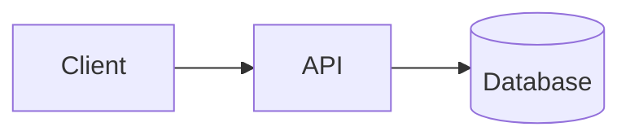

# Design Review

## Problema

Descreva o sistema em uma frase.

## Escopo

### Incluido

- 

### Fora de escopo

- 

## Requisitos funcionais

- 

## Requisitos nao funcionais

- Disponibilidade:
- Latencia:
- Throughput:
- Consistencia:
- Durabilidade:
- Observabilidade:

## Estimativas

- Usuarios:
- QPS:
- Escritas por segundo:
- Leituras por segundo:
- Tamanho medio de evento/payload:
- Armazenamento por dia:

## APIs

```http
POST /example
GET /example/{id}
```

## Modelo de dados

```text
Entity(id, field, created_at)
```

## Arquitetura inicial



## Gargalos

- 

## Evolucao proposta

- 

## Trade-offs

- 

## Metricas

- 

## Falhas simuladas

- 
