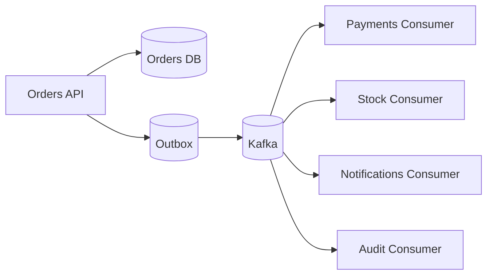

# Projeto Integrador: Event-driven Marketplace

Este projeto e o campo de treino para juntar System Design e Kafka.

## Objetivo

Construir, em etapas, um marketplace simplificado orientado a eventos.

## Dominios

- Catalogo
- Pedidos
- Pagamentos
- Estoque
- Notificacoes
- Auditoria

## Eventos iniciais

```text
ProductCreated
OrderCreated
PaymentRequested
PaymentApproved
PaymentRejected
StockReserved
StockReservationFailed
OrderConfirmed
OrderCancelled
NotificationRequested
```

## Arquitetura alvo



## Etapas

### Etapa 1 - Monolito simples

- Criar pedido via API.
- Salvar pedido em banco.
- Sem Kafka ainda.
- Documentar limites dessa solucao.

### Etapa 2 - Publicacao de eventos

- Publicar `OrderCreated`.
- Criar consumer de auditoria.
- Discutir risco de salvar no banco e falhar ao publicar evento.

### Etapa 3 - Outbox pattern

- Salvar pedido e outbox na mesma transacao.
- Criar publicador da outbox para Kafka.
- Marcar eventos publicados.

### Etapa 4 - Consumidores idempotentes

- Pagamentos e estoque consomem eventos.
- Cada consumer registra `event_id` processado.
- Reprocessamento nao deve duplicar efeito.

### Etapa 5 - Observabilidade

- Medir lag.
- Medir throughput.
- Registrar erros por tipo de evento.
- Criar dead letter topic para mensagens invalidas.

## Questoes de System Design

- Quais partes precisam de consistencia forte?
- Onde consistencia eventual e aceitavel?
- Qual e a key ideal dos eventos?
- Como versionar payloads?
- O que acontece se pagamentos cair por 30 minutos?
- Como reprocessar pedidos de ontem?
- Como evitar que notificacoes lentas afetem pedidos?

## ADRs sugeridos

- Por que Kafka em vez de fila tradicional?
- Por que usar outbox?
- Qual chave de particionamento usar para eventos de pedidos?
- Como lidar com mensagens invalidas?
- Qual estrategia de idempotencia usar?
